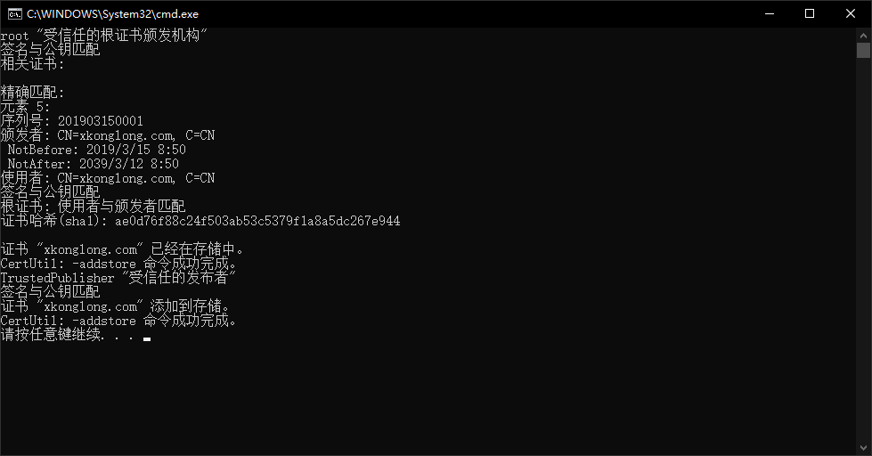

# 入门指引

## 功能简介

根据《党政机关公文格式国家标准》(GB/T 9704—2012)的格式要求，快速设置页面版式、快速设置常用文字格式、插入常用符号、版头、版记、公文页码、红线等。

支持对文字的快速排版，中文首行缩进2字符、删除空白，断句重排等。

支持对文档盖章、可以在文档同目录下生成 PDF/ doc /图片 格式的副本。

可广泛用于各类规范文本的排版。

**本插件完全免费，承诺不含任何恶意代码。**

## 环境需求

操作系统： win7/win8/win10/win11

Office： 

         MS Word 2007 (最高支持版本v1.0.8.3,之后版本不再支持2007)
         MS Word 2010/2013/2016/2019/2021
         MS Word 365
         WPS Office 2013/2016/2019专业版
         WPS Office 个人版(自v1.8.2.0起支持)

运行库需求: NetFrame4.0 和 vsto
<Note type="tip">
1.0.8.3 适用于 Word2007,有离线安装版已内置运行库组件,无需单独下载.适合内网用户.之后版本均为智能安装版，会自动从微软官网下载，内网用户可单独下载附加组件.
</Note>

## 安装说明

首次安装：解压后先运行"首次安装导入证书.bat", 然后运行安装程序。

内网用户：请提前[下载并安装附加组件](https://xkonglong.lanzoui.com/iZeNBvv5tef)。

### 杀软报毒

+ 作者承诺软件不含任何恶意代码。
+ 使用360杀毒或360安全管家的用户，若遇到病毒提示，可提交给[360官方误杀申报](http://sampleup.sd.360.cn/index.php)。
+ 近期 Windows10 自带杀软误报问题, 目前微软回复已移除病毒库,不会再误报。
+ 在保障**官网下载**的前提下，安装时也可暂时禁用杀毒软件。

## 下载地址

**网盘下载地址:**  [蓝奏云](https://xkonglong.lanzoux.com/b00dbbvcj)

**网盘下载地址:**  [城通网盘 密码9561](https://url38.ctfile.com/d/15334738-33069050-4ebf20) 

**网盘下载地址:**  [123云盘](https://www.123pan.com/s/BYLA-CZwHv)

## 捐赠支持

软件免费,如果您用的顺手,又愿意支持作者,可通过微信扫描二维码打赏。

