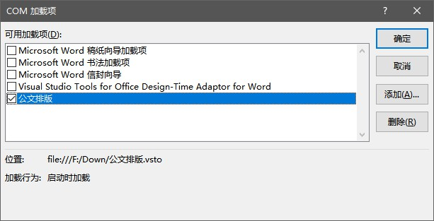

# 常见问题

## 安装出错

### 安装报错1001
**可能原因：** 对微软下载中心的访问网速比较慢导致的无法下载

**解决方案：** 单独下载安装附加组件。

### 已经安装了另一版本的自定义项不能从该位置升级
**解决方案：** 控制面板—添加删除软件—卸载公文排版助手， 然后安装。

## 插件加载

### Office2007 安装后无法正常显示公文插件
**解决方案:**

[请参考微软官网的这篇文件解决.](https://support.microsoft.com/zh-cn/help/976477/description-of-the-2007-office-system-hotfix-package-mso-x-none-msp-october-27-2009)

注意: 2019年起,微软不再提供上文内附的Office2007 KB976477 更新补丁.

如果您之前未能升级该补丁, 请安装更高级版本的Office.

v1.0.8.3之后的版本不再支持 Word2007。

### 预装的 Office家庭和学生版 无法加载插件

目前已知一些品牌机预装的”Office201X家庭和学生版”有较大几率发生此问题。此类Office与安装版存在路径和权限差异，导致其无法很好兼容第三方插件。

**解决方案：**

请卸载此类Store版本Office，然后下载安装 Office.

卸载预装Office，请参见微软官网:[从 PC 卸载 Office](https://support.office.com/zh-cn/article/%E4%BB%8E-pc-%E5%8D%B8%E8%BD%BD-office-9dd49b83-264a-477a-8fcc-2fdf5dbf61d8?ui=zh-CN&rs=zh-CN&ad=CN)

下载和安装正版Office，请参见微软官网：[重装Office](https://support.office.com/zh-cn/article/%E4%B8%8B%E8%BD%BD%E5%B9%B6%E5%AE%89%E8%A3%85%E6%88%96%E9%87%8D%E6%96%B0%E5%AE%89%E8%A3%85-office-2016-%E6%88%96-office-2013-7c695b06-6d1a-4917-809c-98ce43f86479?ui=zh-CN&rs=zh-CN&ad=CN)

**关联微软账号**的 Office 安装后会自动激活，不用担心正版变D版。

### 精简版 Office,安装后无法显示公文插件

**解决方案：** 安装完整版

### Word不是精简版,安装后无法显示公文插件

**解决方案：**
请先确保**附加组件已正确安装**。

查看 Word-选项-自定义功能区-“公文”菜单是否勾选.

 

查看 Word COM 加载项是否禁用公文排版插件.

查看 Word 设置–信任中心设置,是否勾选了”禁用所有应用程序加载项”

查看注册表是否存在如下项目:

(32位Office)
> HKEY_CURRENT_USER\Software\Microsoft\Office\Word\Addins\

(64位Office)

> HKEY_CURRENT_USER\Software\Wow6432Node\Microsoft\Office\Word\Addins

### WPS 不显示插件
+ WPS 个人版需要安装最新版插件才能支持, 旧版插件只支持 WPS 专业增强版.
+ WPS 安装最新版后加载项未显示
   + 解决方案: 确保插件安装未被拦截注册表操作, 运行WPS自带的修复工具重新注册组件即可.

### 其他无法显示插件的情况综述

+ Word的信任中心正在阻止加载项的运行
   + 解决方案：恢复信任中心默认设置，允许加载项加载。或者使用安装包里的"导入证书".
+ 防病毒软件阻止安装Word加载项
   + 解决方案：安装时根据提示允许操作或暂时关闭安全软件。
+ 您正在使用Office 2010 Starter / Wps 个人版
   + 解决方案：office2010 starter 更改到专业版 , WPS 用户安装最新版插件。
+ 您的计算机上安装了两个版本的 Word
   + 解决方案：卸载一个不再使用的版本。
+ Office的旧版本未完全卸载
   + 解决方案：点此访问微软官网，下载专用卸载工具。
+ Word安装已损坏(控制面板添加删除程序无法修复)
   + 解决方案：卸载并重装Office。

## 使用出错

### 插入版记线/页码等公文部件时报错

**解决方案：** 旧版Doc兼容问题，新建一个空白文档，把原文件内容复制过去，然后插入版记线即可。
**解决方案：** 默认模板被错误的修改过，删除默认空白模板即可。

### 新建公文样式时报错

**解决方案：** 系统未安装默认字体，关于-高级设置-指定公文字体。

## 意见反馈

公开渠道: [通过网页反馈](https://support.qq.com/products/57503)

私密渠道:  

更多帮助请入QQ群(1)[661211620](http://shang.qq.com/wpa/qunwpa?idkey=5f81cf0d069901cafc1027691fa8c461dfc996362c930aea0eb2e29589743e1a)  QQ群(2) [956898287](http://shang.qq.com/wpa/qunwpa?idkey=499ea997e2978b0206ad52dbccd28cd2f9efab69c80417d9b0881bea843e82f8)

入群口令: xkonglong
