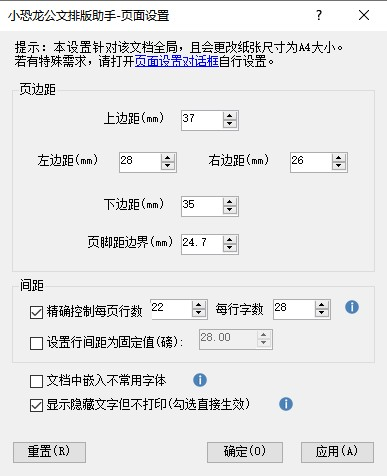

# 功能介绍

## 界面综述

工具栏分为"版面"、"公文标题"、"文字格式"、“插入”、“其他”、“关于”，共六个分组区域。

分别对应了"版面设置","文字样式","插入功能","副本和保密设置","设置和帮助"

## 版面设置

快速设置公文所需的页边距、行数和字数控制、嵌入不常用字体等。

页面设置会自动保存上次设置，无需每次重复调整。

### 中文缩进和顶格

中文缩进可以快速对选定的文字设置段落首行缩进2字符。顶格则是取消缩进。

### 删除页眉横线

插入页码或者对页眉页脚的操作，可能导致 Word 自动为页眉添加横线，使用本功能可以快速去掉横线。

### 排版菜单

可以快速实现“断行重排”、“删除空白”、“删除多余空行”、“全半角替换”、“换行转回车”等等。

尤其适合对复制自 pdf 或网页文字的快速排版。

## 文字样式

该区域可以选定文字进行快速设置， 比如公文大标题、一级至四级公文标题、正文格式。

可以快速替换字体，解决公字体格式不统一的问题。

点击“公文样式”，可以一键生成常用公文样式，通过“样式侧栏”对文字进行段落级别的快速设置。

## 插入功能

+ 快速插入公文红头、红线、版记线、装订线。
+ 快速插入页码（居中，居右，外侧）
+ 快速插入公文格式日期
+ 快速插入公文常用符号，比如六角括号和★等。
+ 快速插入公章（链接式/嵌入式）
+ 快速插入横版页面

## 副本保密

可按照实际需求用于文档分享或备份。

副本功能可以将文档快速生成为 pdf/doc/图片 等格式，功能堪比 WPS 收费项目。

保密功能可以快速设置密码和读写权限。

朗读功能可以便于校对文本，测试演讲效果。

## 高级设置

在关于界面，您可以为作者的辛勤付出，用微信扫码赞助。

您也可以查看系统信息和插件版本并检查更新。

点击“关于”插件，可以进入高级设置，为每个公文格式指定字体名称和大小。

## 应用场景

公文排版助手不仅可以用于政府机关常见的15种公文, 也可以广泛用于各类规范文本的排版。

以下是一些常见应用场景，均为实际用户自行分享的文章。

[广州互联网法院:种草效率神器](https://mp.weixin.qq.com/s?src=11&timestamp=1586149473&ver=2261&signature=R7JQv5HXZy-4WiTkTNfwpSnIDlmn35Z82BsC3DBWzlE3ZSRjss6f-qEdnK-H-nU-ACHUaYPl5edEz4QRTO2ROd7NqX8JkpyYmMeWw6WpFoWfpus*Bgl0zgYdgbGuPLCF&new=1)
[超强Word排版插件，论文、标书、报告、公文等排版，一键搞定](https://mp.weixin.qq.com/s?src=11&timestamp=1586154104&ver=2261&signature=BQQxJU71YFQRD87xuYK8ZI2GAxd8imZ02zNJe8aOvZelbvQWcgVDdqRQtZLgZtrZlPp8Z-s-9LHj8Ni1jZAQ3qbHEyXJG7atCYdXWZC6gQedYvTvaF7Q-gsnADWLCpWf&new=1)
[30000 字文档、论文 5 分钟完成格式排版，大学生和职场码字人士的救命插件！](https://mp.weixin.qq.com/s?src=11&timestamp=1586154394&ver=2261&signature=*9i3oxepdAqYLfc40Sto5sRBoxV*smOvmvmjpMSMCbCj3OSTFL3MkoMx9UZ48iPpnVT3VraNNWLoN5XBo*ao-DxMnQXRWzTswynP8ZNMSi6pa0lbCFxX3iolAbSeti2x&new=1)

