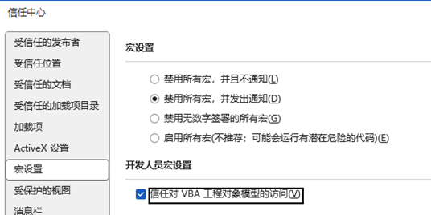

## VBA功能指南

## 一、VBA功能能做什么？

尽管公文排版助手已经提供了大量的排版功能，但是具体到每个用户，往往众口难调。若插件本身集成大量繁杂的功能，不仅会影响运行速度，还可能增加更多bug，逐渐变得臃肿，这并不符合“小而美”的思想。

+ 实现更多功能，满足更多需求，比如《公文自动排版》、《多文件批量修改》、《图片批量调整》……
+ 即用即走，文档不保存VBA代码，不占空间，减少安全隐患；
+ VBA代码可见，可自由修改，保存和分享。

## 二、VBA文件使用篇

## （一）使用方法：

+ 第一步：先保存文档。（避免错误的VBA文件造成损失）
+ 第二步：点击“运行VBA”按钮，在打开文件对话框里，选择一个合适的VBA文件即可。
+ 第三步：部分VBA会有交互操作，按照提示进行。

## （二）注意事项：

VBA文件的后缀名通常为.vba或者.bas。

一般来说.vba是专用于本插件的文件，.bas则是Word Visual Basic编辑器导出的文件。

它们都可以执行，但是.bas并不是专为插件服务，有可能存在一些bug或兼容性问题，需要代码制作者略作修改。

注意：请务必保证VBA代码安全可靠，插件作者不承担VBA文件造成的任何损失！

您可将VBA文件上传到 https://www.virscan.org/ 进行病毒检验。

## (三)常见问题:

## 问题一:VB Project访问不被信任
 
解决方法：
打开 Word 选项->信任中心->宏设置:

勾选“禁用所有宏，并发出通知”（保障安全性）

勾选“信任对VBA工程对象模型的访问”，（开启本功能）

## 问题二：无法执行指定的宏

通常情况下，是所选的.vba文件有bug，导致其无法执行。

您可以联系代码作者或分享人，也可以用记事本自行查看该文件。

## 问题三：所选文件非ANSI编码
 
解决方法：记事本另存时选择ANSI编码即可，其他编辑器可选为简体中文GB2312。

## 问题四：异常来自HRESULT:0x800A802D的错误提示

运行错误的VBA代码导致Word解释器出错，在当前文档残留有执行失败的模块文件。

解决方法：	点击 清理VBA代码 按钮。或进入VB编辑器，删除所有代码，保存文档即可。

## 问题五：代码陷入死循环导致Word停止响应。

先尝试按ESC中断执行，若不正确的代码导致死循环，解决方法如下：

第一步：关闭并重启Word。

第二步：遇到*禁用加载项*对话框时，千万记得点“否”：

第三步：用编辑器检查核实 VBA代码 是否兼容或存在Bug。

## 问题六：WPS Office 运行出错
 
解决办法：

第一步: 最新版WPS Office默认不再支持VBA，请在开发工具->切换到VB环境 ，或者更换其他支持VBA版本的WPS，

免费切换VB环境的方法: https://www.bilibili.com/video/BV19y4y1X7DE/

第二步: WPS Office 选项中 勾选“信任对于VB项目的访问”

##  三、VBA文件制作篇

## （一）制作VBA文件最常用的方法

+ 复制或下载别人分享的VBA文件,直接运行该文件即可。
+ 使用Word宏功能来录制你的操作,然后编辑宏代码,导出为.bas文件。
+ 在Word内置的Visual Basic编辑器里编辑并调试代码,导出为.bas文件。
+ 经过调试验证后的代码文件，建议保存为.vba再分享。

## （二）制作VBA需要注意的问题

+ 一个VBA只做一件事，制作VBA文件时,请只保留一个Sub……End Sub代码块用于执行,其他调用过程改用Function关键字。过程名称建议用中文,可前缀您的ID,具体参考我分享的演示代码文件。
+ VBA文件请使用ANSI(简体中文GB2312)编码保存,Word VBA不支持UTF-8这类编码,会导致中文乱码。
+ 不正确的代码可能导致Word崩溃、文档丢失或损坏，请勿故意制作和传播具有破坏性的VBA文件，否则可能触犯刑法第285和286条。
+ 分享或复制VBA代码时，请尊重作者版权，注明来源，保留注释。
